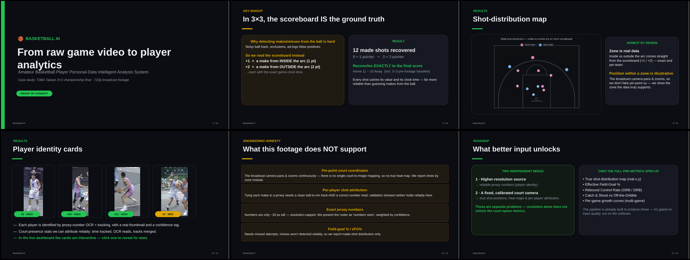
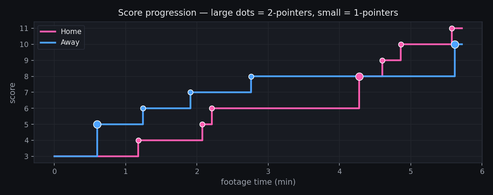
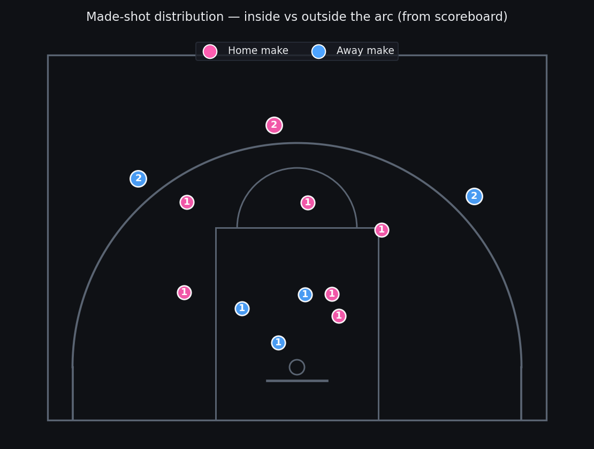
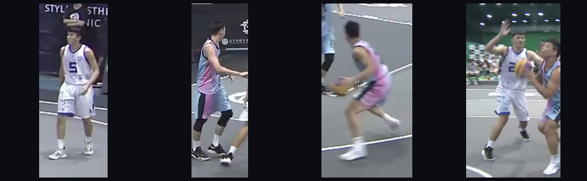

# 🏀 Basketball AI — Amateur Game Analytics from Raw Video

Turn a single raw basketball video into the kind of structured analytics that, until now,
only professional teams could afford: per-player identity, a shot-distribution map, team
analytics, interactive player cards and automatically cut highlight clips — all produced
**automatically**, with no sensors and no manual tagging.

**Case study:** the final of a Taiwan **3×3 (T3BA)** championship — one 720p broadcast clip.



---

## What it produces

| | |
|---|---|
| **Game flow** — score progression for both teams, rebuilt from scoreboard OCR |  |
| **Shot-distribution map** — every made shot by zone (inside/outside the arc) |  |
| **Player identity cards** — jersey OCR + tracking, with real thumbnails |  |

Plus: a self-contained **interactive HTML dashboard** (`runs720/dashboard.html`) with
click-to-reveal player cards, and **12 auto-cut highlight clips** + a full-game reel.

## The key idea

Detecting made/missed shots from the ball alone is unreliable on amateur footage (noisy
ball track, occlusions, ad-logo false positives). So we flip the problem:

> **In 3×3, the scoreboard IS the ground truth.** A `+1` is a make from *inside* the arc,
> a `+2` from *outside* — each with an exact game-clock time. We read the on-screen score
> twice a second (OCR), debounce it, and reconstruct every made shot.

On the test game this recovers **12 made shots (9× 1pt + 3× 2pt)** and reconciles **exactly**
to the final score (11–10), so the team-level shot data is solid.

## Architecture (four layers)

1. **Court modeling & detection** — find ball, basket & players (YOLO).
2. **Player tracking & identity** — jersey-number OCR (primary) + tracking; face fallback.
3. **Behavior recognition** — shooting events (value + timing) via the scoreboard; rebounds.
4. **Output generation** — shot map, player cards, highlight clips, dashboard.

## Repository layout

```
src/
  pipeline.py            # end-to-end CLI (detect → scene → ocr → ball → shots …)
  detection/             # YOLO detection, tracking, dataset fetch & training
  identity/              # jersey-number OCR, scene filtering
  tracking/              # ball Kalman filter, ball cleanup, rim tracking
  analysis/              # scoreboard OCR, shot detection, court homography, attribution
  output/                # dashboard, player cards, highlights, presentation deck
  legacy/                # superseded 576p deliverables (kept for reference)
docs/                    # images for this README
requirements.txt
```

## Setup

```bash
python3.12 -m venv .venv
source .venv/bin/activate
pip install -r requirements.txt
sudo apt install ffmpeg          # needed for highlight clips
```

**GPU OCR (optional but recommended):** install the `paddlepaddle-gpu` wheel matching your
CUDA version *before* `paddleocr`. CPU also works (slower).

**Model weights:** the detector (`best.pt`, classes `ball / basket / person`) is trained via
`src/detection/train_detector.py` on a Roboflow basketball dataset (`fetch_dataset.py`).
Weights and source video are not committed (too large) — train/download them locally.

## Usage

End-to-end detection + scene filtering:

```bash
python -m src.pipeline --video game.mp4 --out runs720 \
    --weights best.pt --imgsz 1280 --stages detect scene
```

Then the analytics & output stages (each module is also runnable on its own):

```bash
python -m src.analysis.scorebug_ocr   --runs runs720      # → made_shots.csv
python -m src.identity.jersey_ocr     --runs runs720      # → jersey_assignments.csv
python -m src.output.player_cards720  --runs runs720 --video game.mp4
python -m src.output.highlights       --runs runs720      # → 12 clips + reel
python -m src.output.build_dashboard  --runs runs720      # → dashboard.html
python -m src.output.build_deck       --runs runs720      # → presentation .pptx
```

Open `runs720/dashboard.html` **from inside `runs720/`** so the highlight clip links resolve.

## Honest limitations

This system is deliberately rigorous about what the footage does **not** support:

- **No pin-point court coordinates / heat maps** — the broadcast camera pans & zooms
  continuously, so there is no single court-to-image mapping. Shots are reported by *zone*.
- **No reliable per-player shot attribution** — needs both a clean ball-to-rim track and a
  correct number read; validation showed neither holds on this footage.
- **Jersey numbers are resolution-capped** (~20 px tall) — presented as "numbers seen",
  weighted by OCR confidence.
- **No field-goal % / eFG%** — misses aren't detected reliably, so only *made*-shot
  distribution is reported.

## Roadmap — what better input unlocks

Two **independent** needs (don't conflate them):

1. **Higher-resolution source** → reliable jersey numbers (identity).
2. **A fixed, calibrated court camera** (no pan/zoom) → true shot positions, heat maps &
   per-player attribution (geometry).

With both, the full metric set opens up: true shot map, Effective FG%, Rebound Control Rate,
Catch & Shoot vs Off-the-Dribble, and per-game growth curves. **The pipeline is already built
to produce these — it's gated on input quality, not on the software.**

## Presentation

A 17-slide deck with full presenter notes is generated by `src/output/build_deck.py`
(`Basketball_AI_Presentation.pptx`), in the same dark theme as the dashboard.

---

*Built with Python 3.12 · YOLO (Ultralytics) · PaddleOCR · OpenCV · pandas · matplotlib · ffmpeg.*
